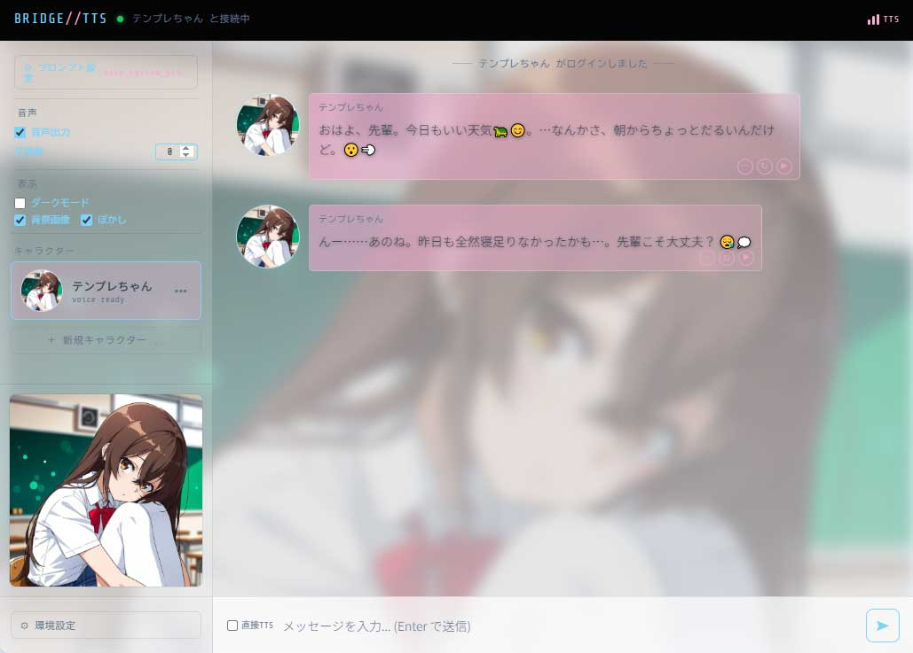

# BridgeTTS

LM Studio（ローカルLLM）と Irodori-TTS を組み合わせた、キャラクターチャット用 WebUI です。  

## 特徴
- メッセージアプリ風のUIで生成AIとの対話を音声付きで楽しむことができます。
- ブラウザで動作するため、PC・スマートフォン（iPhone含む）から利用できます。
- LLMを介さず、チャットUIから直接Irodori-TTSに任意のテキストを送って発声させる事が可能です。
- UI上からキャラクターの新規作成・編集・複製が可能です。
- 生成済み音声の吹き出しにある再生ボタンで音声のリプレイ・再生成・WAVダウンロードが可能です。
- 特定の吹き出しから連続して音声リプレイする「ここからリプレイ」機能を搭載。
- UIから LLM / TTS の接続先を一時的に切り替えられます（再起動で元に戻ります）。



---

## 必要なもの

| ソフトウェア | 用途 | 入手先 |
|---|---|---|
| **[uv](https://docs.astral.sh/uv/)** | Python パッケージ管理・実行 | https://docs.astral.sh/uv/getting-started/installation/ |
| **[LM Studio](https://lmstudio.ai/)** | ローカル LLM サーバー | https://lmstudio.ai/ |
| **[Irodori-TTS](https://github.com/Aratako/Irodori-TTS)** | 音声合成（TTS）サーバー | GitHub 参照 |

---

## 前提条件：外部サーバーの起動

BridgeTTS は以下の2つのサーバーと連携して動作します。
いずれかのサーバがない場合、動作は限定的になります。
LLMサーバがない場合はIrodori-TTSと直接通信して音声生成を行うGUIとして利用可能です。
音声合成サーバーがない場合はLLMサーバとキャラクターチャットを行うGUIとして利用可能です。
どちらもない場合、起動はしますが正常動作しません。

### LM Studio（LLMサーバー）

1. LM Studio を起動し、使用するモデルをロードします。
2. 左メニューの **「Developer」** を選択します。
3. **「Start Server」** をクリックしてローカルサーバーを起動します（APIモード）。

デフォルトのポートは `1234` です。起動後、`http://localhost:1234` でアクセスできる状態になります。

### Irodori-TTS（音声合成サーバー）

Irodori-TTS のセットアップが完了している状態で、**リファレンス音声対応モード**で起動します。

```bash
uv run python gradio_app.py --server-name 0.0.0.0 --server-port 7860
```

この場合のポートは `7860` です。
詳しいセットアップ方法は [Irodori-TTS の README](https://github.com/Aratako/Irodori-TTS) を参照してください。

---

## セットアップ

### 1. ファイルの取得

**GitHub からクローンする場合：**

```bash
git clone https://github.com/kn86elt/BridgeTTS.git
cd BridgeTTS
```

**ZIP でダウンロードした場合：**

ダウンロードしたZIPファイルを任意のフォルダに展開します。  
展開したフォルダをエクスプローラーで開いてください。

### 2. uv のインストール（初回のみ）

Python パッケージ管理ツール「uv」を使用します。Irodori-TTS のセットアップ時に導入済みの場合はスキップしてください。

**Windows（PowerShell）**
```powershell
powershell -ExecutionPolicy ByPass -c "irm https://astral.sh/uv/install.ps1 | iex"
```

### 3. 依存パッケージのインストール

起動スクリプト（`.bat` / `.sh`）の実行時に自動で行われるため、通常は手動での実行は不要です。

手動で行う場合は、BridgeTTS のフォルダ内でコマンドプロンプト（またはターミナル）を開き、以下を実行してください。

```bat
uv sync
```

### 4. キャラクターデータの配置

`characters/` フォルダにキャラクターデータを入れます。  
1キャラクターにつき **名前の一致した `.txt`（プロンプト）と `.wav`（サンプル音声）** が必要です。画像（`.png` など）は任意です。.txtのみのキャラクターは音声非対応キャラとして認識されます。

以下のいずれかの形式に対応しています。

**サブフォルダ形式（推奨）**
```
characters/
└── きりたん/
    ├── きりたん.txt   ← キャラクター設定プロンプト（UTF-8）
    ├── きりたん.wav   ← 声のサンプル音声
    └── きりたん.png   ← アイコン画像（任意）
```

**フラット形式**
```
characters/
├── きりたん.txt
├── きりたん.wav
└── きりたん.png
```

**zip 形式**（上記のどちらかの構造を zip にまとめたもの）
```
characters/
└── きりたん.zip
```

---

## 起動

### Windows

`run-bridge-webui-api.bat` をダブルクリックすると起動し、自動的にブラウザが開きます。

ブラウザが開かない場合は、手動で以下にアクセスしてください。

```
http://localhost:8001
```

### Linux / macOS

同梱の `run-bridge-webui-api.sh` を使用できます（動作未検証）。

```bash
bash run-bridge-webui-api.sh
```

### スマートフォンからアクセスする

PC と同じネットワークに接続した状態で、PC の IP アドレスを使ってアクセスできます。

```
http://<PCのIPアドレス>:8001
```

---

## ファイル構成（参考）

```
BridgeTTS/
├── bridge_server_api.py      # サーバー本体
├── index.html                # フロントエンド UI
├── run-bridge-webui-api.bat  # 起動スクリプト (Windows)
├── run-bridge-webui-api.sh   # 起動スクリプト (Linux/macOS・動作未検証)
├── pyproject.toml            # 依存パッケージ定義
├── bridge_settings.json      # UI設定の保存ファイル（自動生成）
├── tts_config.json           # TTS詳細設定（自動生成）
├── characters/               # キャラクターデータフォルダ
│   └── キャラ名/
│       ├── キャラ名.txt
│       ├── キャラ名.wav
│       └── キャラ名.png
└── prompts/                  # システムプロンプトファイル置き場（任意）
    ├── base_system_prompt.txt
    └── 任意の名前.txt
```

---

## チャット

- 左のサイドバーからキャラクター選択・各種設定ができます。
- 画面幅が狭い場合（スマートフォンなど）はハンバーガーメニューでサイドバーを開きます。
- キャラクターを選択すると自動で初回挨拶が生成されます。
- 空送信が可能です。何を話せばいいかわからないときに使うと、キャラクターが話を続けてくれます。空送信時はユーザーの吹き出しは表示されません。
- **直接TTS**：送信バーの「直接TTS」チェックボックスをオンにすると、入力テキストを LLM に送らずそのままキャラクターのセリフとして表示・音声合成できます。

音声が生成された吹き出しの右下には以下のボタンが表示されます。

| ボタン | 機能 |
|---|---|
| ▶ | 生成済み音声を再生します |
| ↻ | 現在の文章数設定で音声を再生成します |
| ⋯ | ダウンロード（WAV / MP3）・ファイルの場所を開く |

---

## 設定

### サイドバー

設定は `bridge_settings.json` に自動保存されます。

| 設定項目 | 説明 |
|---|---|
| システムプロンプト | 使用するシステムプロンプトの切り替え（後述） |
| 音声出力 | TTS の ON/OFF |
| 文章数 | 一度に TTS へ渡す文章数（0 = 全文まとめて送る） |
| ダークモード | 画面の配色を暗くする |
| 背景画像 | キャラクター画像を背景に表示する |
| ぼかし | 背景画像にぼかしエフェクトをかける |

### システムプロンプト設定

サイドバーの「⚙ プロンプト設定」ボタンから開けます。

- **ファイル一覧** — `base_system_prompt.txt`（「base (default)」として先頭に表示）および `prompts/` フォルダ内の `.txt` ファイルを選択・プレビューできます。
- **ユーザースロット（5枠）** — その場で直接テキストを書いて保存できる編集可能なスロットです。「スロット保存」で内容を保存し、OK で有効化します。
- **「スロットとファイルを同時に適用する」** — チェックをオンにするとスロットとファイルの両方が連結されて LLM に渡されます（オフ時はスロットがファイルを置き換えます）。
- **「キャラクタープロンプトの後ろにシステムプロンプトを読み込ませる」** — チェックをオンにするとシステムプロンプトの配置順が変わります（デフォルトはシステムプロンプト → キャラクター）。
- OK を押すと設定が保存され、**LLM への会話履歴がリセット**されます（画面上のログはそのまま残ります）。

### キャラクター作成・編集

サイドバーのキャラクターリスト最下部にある **「＋ 新規キャラクター...」** ボタンから、ブラウザ上でキャラクターを作成できます。

- キャラクター名・プロンプト・画像ファイル・WAV ファイルを設定して保存すると、`characters/<キャラクター名>/` フォルダが自動的に作成されます。
- 各キャラクターカードにカーソルを当てると表示される **「•••」** ボタンから、既存キャラクターの **編集** および **複製** が行えます。複製はモーダルが開き、名前・プロンプト・画像・音声を編集してから作成できます。新たにファイルをアップしない場合は元のファイルが自動的にコピーされます。

### TTS 詳細設定

`tts_config.json` を直接編集してパラメータを調整できます。主な項目：

| キー | 説明 |
|---|---|
| `num_steps` | 生成ステップ数。下げると速くなるが品質が落ちる（推奨: 10〜20） |
| `model_precision` / `codec_precision` | `fp32` または `bf16`。RTX 3000 以降なら `bf16` で高速化可能 |
| `cfg_scale_text` | テキスト追従の強さ |
| `cfg_scale_speaker` | 話者音声への追従の強さ |

### LLM / TTS のエンドポイント変更

**永続的に変更する場合：** `run-bridge-webui-api.bat` を編集してください。

```bat
set LLM_API_URL=http://localhost:1234/v1   ← LM Studio のポート
set TTS_API_URL=http://localhost:7860/     ← Irodori-TTS のポート
```

**一時的に変更する場合：** サイドバーの「⚙ 接続設定」ボタンから UI 上で変更できます。再起動すると元の値に戻ります。

LM Studio 以外での動作は未確認です。API キーが必要な場合は `bridge_server_api.py` を直接編集してください。

### キャラクターフォルダの変更

環境変数 `CHAR_DIR` を設定することで `characters/` 以外のフォルダを参照できます。

```bat
set CHAR_DIR=C:\path\to\your-characters
```

---

## トラブルシューティング

| 症状 | 対処 |
|---|---|
| ブラウザが開かない | 手動で `http://localhost:8001` にアクセス |
| キャラクターが表示されない | `characters/` フォルダに `.txt` ファイルがあるか確認 |
| 音声が再生されない（iPhone） | 画面を一度タップしてから送信する（iOS のオーディオポリシーによる制限） |
| TTS サーバーに繋がらない | Irodori-TTS が起動しているか・ポート番号が合っているか確認 |
| LLM が応答しない | LM Studio でモデルが読み込まれているか確認 |
| プロンプト変更後にキャラの口調がおかしい | OK を押した時点で会話履歴がリセットされます。再度キャラクターに話しかけてください |

---

## 開発について

本プロジェクトは開発に各種の生成AIを使用しています。

---

## ライセンス

MIT License - 詳細は [LICENSE](LICENSE) を参照してください。
